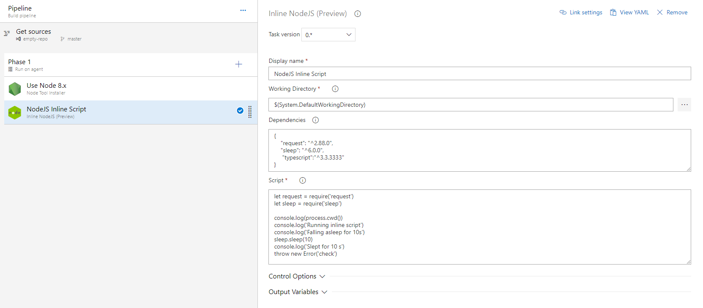

# Azure DevOps Inline NodeJS Task

## Introduction

This task allows you to use NodeJS tool and execute your script inline, without need of fetching sources from repository.

It relies heavily on built-in `Node Tool Instaler` task and uses installed `npm` and `node` tools in order to execute script. Make sure that you set desired Node version and executed `Node Tool Installer` before running this task.

## Motivation

In modern world of development almost evey task can be achieved using JavaScript, so why not make things simpler and use it in your pipeline?

Designing and implementing pipeline is not an easy task, especially in micro-services world. Often people keep exactly the same parts of pipelines for multiple projects in multiple repositories. Making changes to such pipelines requires lots of additional and unnecesary synchronization work.

The best way to avoid this is reuse common parts with YAML pipleine definition and share it among multiple projects. However shared pipelines only support inline scripts, which forces people to use one of shell scripting languages. The aim of this task is to make it possible to design pipeline steps using NodeJS script.

## Configuration

Task currently cosists of three input fields

### Working directory

Path to directory where package will be created and script will be executed, by default it is set to `$(System.DefaultWorkingDirectory)`. 
Bear in mind that package is placed in new directory with randomly generated name, so if you plan to use file system adjust your paths accordingly.

### Dependencies

JSON object containing script dependencies. By default it is empty and accepts properties defined using the same notation as `package.json` in `dependency` or `devDependency` sections.

### Input example

```JSON
{
    "request": "^2.88.0",
    "sleep": "^6.0.0"
}
```

### Script

Contains conent of NodeJS script. Version of Node depends on value used in `Node Tool Installer` task.


**Input example**

```JavaScript
let request = require('request')
let sleep = require('sleep')

console.log('Falling asleep for 10s')
sleep.sleep(10)
console.log('Slept for 10s')

request('https://jsonplaceholder.typicode.com/todos', function (err, res, body) {
  console.log(`Status Code: ${res.statusCode}`)
})
```

**Visual Definition Example**



**YAML Definition Example**

```YAML
steps:
- task: NodeJsExec@0
  displayName: 'NodeJS Inline Script'
  inputs:
    dependencies: |
     {
         "request": "^2.88.0",
         "sleep": "^6.0.0"
     }
    script: |
     let request = require('request')
     let sleep = require('sleep')

     console.log('Falling asleep for 10s')
     sleep.sleep(10)
     console.log('Slept for 10s')

     request('https://example.api/', function (err, res, body) {
       console.log(`Status Code: ${res.statusCode}`)
     })

```

## Changelog

`0.1.0`

* Initial preview release

## Feauture ideas

* Use custom NPM registry as currently only official npm is supported


## Task Icon

Icon made by Freepik from www.flaticon.com
